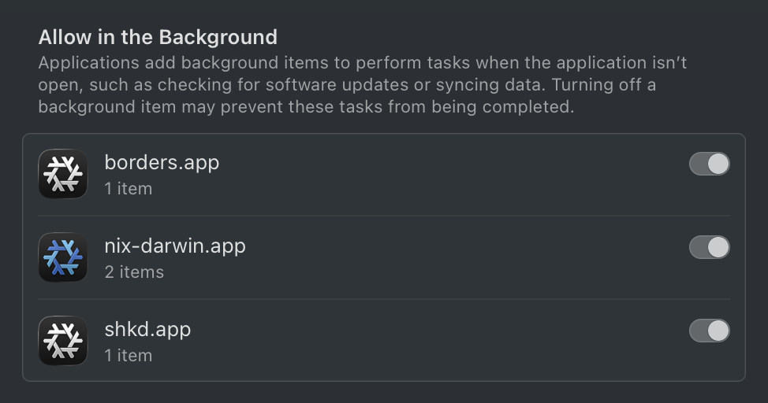

# nix-darwin-smapp

**Nix snowflake icon for nix-darwin services in macOS Login Items**



## Problem

nix-darwin LaunchAgents/Daemons appear as generic "sh" entries labeled
"Item from unidentified developer" in **System Settings > General > Login Items & Extensions**.
There is no way to distinguish them from each other or from non-nix services.

Related issues:
- [nix-darwin#871](https://github.com/nix-darwin/nix-darwin/issues/871) — wrap launch agents in named files
- [nix-darwin#558](https://github.com/nix-darwin/nix-darwin/issues/558) — mysterious items in Login Items pane
- [nix-darwin#1678](https://github.com/nix-darwin/nix-darwin/issues/1678) — generic "sh" due to `/bin/sh -c` pattern

## Approach

Instead of legacy LaunchAgent plists, register services via Apple's SMAppService
API. This gives nix-darwin services a proper icon and name in System Settings -
even with ad-hoc code signing.

### How it works

1. A Nix derivation builds one or more synthetic `.app` bundles, each containing:
   - **Compiled C wrappers** for each service (tiny binaries that `execv("/bin/sh", "-c", command)`)
   - **Embedded LaunchAgent plists** with `AssociatedBundleIdentifiers`
   - **Objective-C register binary** that calls `SMAppService.agent().register()`
   - **App icon** (e.g. Nix snowflake `.icns`)
   - **Info.plist** with bundle metadata

2. An activation script (runs during `darwin-rebuild switch`):
   - Scans installation directory and unregisters all previously registered smapp bundles
   - Symlinks new bundles from `/nix/store/...` into installation directory
   - Runs `open` to trigger `SMAppService` registration

3. macOS displays the bundle icon and name in Login Items for all registered services.

### Additional properties of SMAppService

- **Auto-cleanup**: when the parent `.app` bundle is removed, macOS automatically
  unregisters all associated agents - no stale entries from old Nix generations
- **User control**: users can toggle services on/off in System Settings
- **Survives reboot**: registered agents with `RunAtLoad` persist across reboots
- **Symlinks**: the `.app` bundle can be a symlink to `/nix/store/...`

## Testing POC as a nix-darwin module

Add to your flake inputs:

```nix
inputs.nix-darwin-smapp = {
  url = "github:YOUR-USER/nix-darwin-smapp";
  inputs.nixpkgs.follows = "nixpkgs";
};
```

Add the module to nix-darwin configuration:

```nix
modules = [
  inputs.nix-darwin-smapp.darwinModules.default
  # ...
];
```

Configure services grouped into bundles:

```nix
  services.nix-darwin-smapp = {
    enable = true;
    bundles = {
      nix-system = {
        bundleIdentifier = "org.nixos.nix-system";
        bundleName = "nix-darwin";
        services = {
          "org.nixos.smapp.test-daemon" = {
            command = "exec /bin/sleep 86400";
          };
          "org.nixos.smapp.store-mount" = {
            command = "exec /bin/sleep 86400";
          };
        };
      };
      borders = {
        bundleIdentifier = "org.nixos.borders";
        bundleName = "borders";
        icon = inputs.nix-darwin-smapp.icons.nix-snowflake-white;
        services = {
          "org.nixos.smapp.borders" = {
            command = "exec /bin/sleep 86400";
          };
        };
      };
      shkd = {
        bundleIdentifier = "org.nixos.shkd";
        bundleName = "shkd";
        icon = inputs.nix-darwin-smapp.icons.nix-snowflake-white;
        services = {
          "org.nixos.smapp.skhd" = {
            command = "exec /bin/sleep 86400";
          };
        };
      };
    };
  };
```

Each bundle appears as a separate entry in System Settings with its own icon,
grouping its services under "N items".

## Limitations and caveats

- Shell scripts cannot be codesigned — each service needs a compiled C wrapper
  (generated automatically by the Nix derivation)
- `SMAppService.agent().register()` must run in the context of the `.app` bundle
  (via `open`), so the activation script uses `sudo -u <console-user> open -W`
- The `.app` suffix is always shown in System Settings (e.g. "nix-darwin.app") —
  this is a macOS UI convention for all app-type entries
- **Service identifier conflicts**: SMAppService cannot register an agent whose
  identifier matches an existing legacy LaunchAgent (e.g. `org.nixos.skhd`).
  Use a different identifier namespace (e.g. `org.nixos.smapp.skhd`) or remove
  the legacy plist first
- **Unregister requires user context**: `register --unregister` must run as the
  console user, not root — root cannot unregister user-scoped SMAppService agents
- **BTM cleanup on removal**: calling `unregister` marks agents as disabled, but
  entries may persist in System Settings UI until reboot. Full cleanup happens
  automatically when the `.app` bundle is removed from disk (e.g. after
  `nix store gc` removes old generations)
